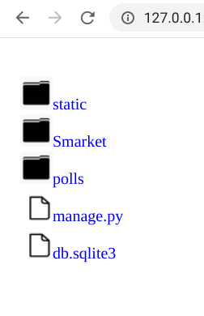

# File_Server

This is a simple, one-file-does-it-all file serving TCP server for your local directory.<br/><br/>
With an easy ngrok setup, you can even open up your port and enable public to download and access your files.<br/><br/>
Note: Only a handful of file formats are going to display directly in the browser. If your file format doesn't belong to the following list, pressing the file link will download the file directly.
1. .pdf
2. .txt
3. .json
4. .png
5. .jpg/ .jpeg
6. .html

# Instructions
1. Clone WebServer.py in the directory you want to share.<br/>
2. Run the following command in that directory:
```
python WebServer.py (port number)
```
3. Open up localhost (127.0.0.1:{port}) in your browser. You shall see the directory content listed.<br/>

<br/><br/>
Screenshot using Chrome:<br/>

 
 
 
# Prerequesite
You need to get Python 3 installed.
