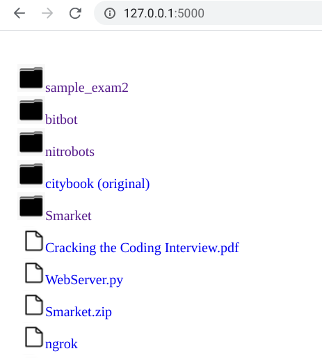

# File_Server

Simple and light-weight file serving TCP server for your directory.<br/>

With an easy ngrok setup, you can enable public to download and access your files.
<br/>
1. Place the python file in the dedicated directory.<br/>
2. Run command:
```
python WebServer.py (port number)
```
and you will get the current directory shared.<br/>
3. Go to your localhost using a browser. You should see the directory content listed.

 
# Prerequesite
You need to get Python 3 installed.
